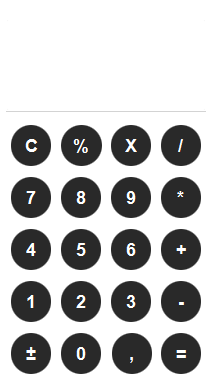

#  CalcFX - Uma Calculadora Moderna e Inteligente com JavaFX

 
*(Dica: Tire um print da sua aplicação finalizada e salve como `screenshot.png` na pasta do projeto)*

---

Uma calculadora de desktop funcional, construída do zero com Java, JavaFX e FXML. Seu diferencial é um motor de cálculo que respeita a **ordem de precedência de operações (PEMDAS)**, permitindo a resolução de expressões matemáticas complexas de forma precisa.

Este projeto foi desenvolvido como um estudo aprofundado sobre a criação de interfaces gráficas, gerenciamento de estado e implementação de algoritmos de cálculo em Java.

---

## ✨ Funcionalidades

* **Motor de Cálculo com Ordem de Precedência (PEMDAS):** Resolve expressões respeitando a ordem do PEMDAS.
* **Operações Aritméticas Completas:** Adição (`+`), subtração (`-`), multiplicação (`*`) e divisão (`/`).
* **Funções Avançadas:**
    * **Porcentagem (`%`):** Modifica o número atual para seu valor percentual, funcionando corretamente em qualquer ponto da expressão.
    * **Inversão de Sinal (`+/-`):** Inverte o sinal do número atual ou de um resultado final.
* **Interface Moderna e Intuitiva:**
    * Design limpo e minimalista com botões circulares.
    * Feedback visual para interações do usuário (`hover` e `pressed`).
    * Estilo customizado com CSS para uma aparência profissional.
* **Visor Duplo de Histórico:**
    * Um visor principal para o número sendo digitado ou o resultado final.
    * Um visor secundário que exibe a expressão completa em tempo real.
* **Controle de Entrada Robusto:**
    * Limite de 15 caracteres por número para manter a clareza.
    * O botão Backspace (`<-`) permite apagar dígitos ou o último operador inserido.
    * Validação para impedir a inserção de múltiplos operadores consecutivos.

---

## 🛠️ Tecnologias Utilizadas

* **Java 25**
* **JavaFX 25**
* **Maven** - Para gerenciamento de dependências e do ciclo de vida do projeto.
* **FXML** - Para a estruturação declarativa da interface do usuário, separando o design da lógica.
* **CSS** - Para estilização avançada dos componentes, design e temas.

---

## 🚀 Como Executar o Projeto

Para clonar e executar este projeto localmente, você precisará ter o [JDK (Java Development Kit)](https://www.oracle.com/java/technologies/downloads/) e o [Apache Maven](https://maven.apache.org/download.cgi) instalados e configurados no seu sistema.

```bash
# 1. Clone o repositório para sua máquina local
git clone

# 2. Navegue até a pasta do projeto
cd CalcFX

# 3. Compile e construa o projeto usando o Maven
mvn clean install

# 4. Execute a aplicação com o plugin do JavaFX
mvn javafx:run
```
> **Nota para IDEs (IntelliJ):** Ao importar como um projeto Maven, a IDE deve configurar o JDK e as dependências automaticamente. A execução pode ser feita diretamente pela classe `App.java`.

---

## 📄 Licença

Este projeto está sob a licença MIT. Veja o arquivo [LICENSE.md](LICENSE.md) para mais detalhes.

---

*Desenvolvido com a assistência da IA Gemini do Google.*
